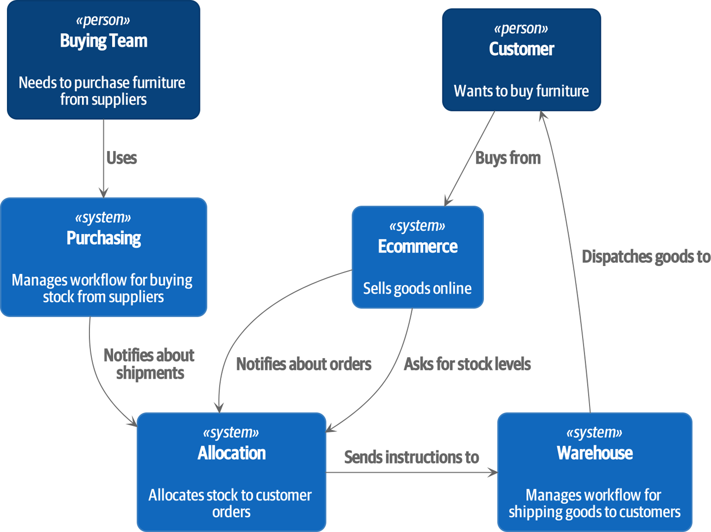

# TDD + DDD Using Architecture Patterns 

This project attempts to solve the problem presented in [Architecture Patterns with Python](https://learning.oreilly.com/library/view/architecture-patterns-with/9781492052197/).

## Problem Statement 

MADE.com is a furniture retailer that sources furniture from manufacturers all over the world and sell it across Europe  

At a high level, we have separate systems that are responsible for buying stock, selling stock to customers, and shipping goods to customers. A system in the middle needs to coordinate the process by allocating stock to a customer’s orders

**Current System** 

For the purposes of this book, we’re imagining that the business decides to implement an exciting new way of allocating stock. Until now, the business has been presenting stock and lead times based on what is physically available in the warehouse. If and when the warehouse runs out, a product is listed as “out of stock” until the next shipment arrives from the manufacturer.

**Goal** 

Here’s the innovation: if we have a system that can keep track of all our shipments and when they’re due to arrive, we can treat the goods on those ships as real stock and part of our inventory, just with slightly longer lead times. Fewer goods will appear to be out of stock, we’ll sell more, and the business can save money by keeping lower inventory in the domestic warehouse.

## Process

### Batch: 
    
* Batch is a Domain  Model 
* Batch should have the following  attributes: 
    - [x] Reference 
    - [ ] SKU
    - [ ] Eta 
    - [ ] Available quantity 
* Batch should be able to do the following:
    - [ ] Allocate x items in the Batch based on an order 
        - [ ] Given current available items 
        - [ ] Idempotent 
        - [ ] Matching SKUs 
        - [ ] Decrement available items 
    - [ ] Can de-allocate 
        - [ ] Increment available items 

## Notes

Describe any challenges encountered while building the app.
